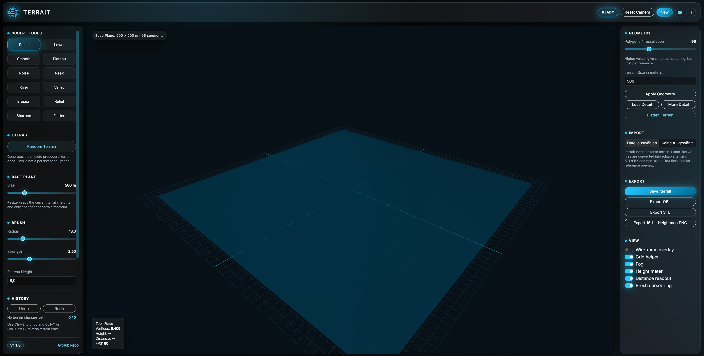
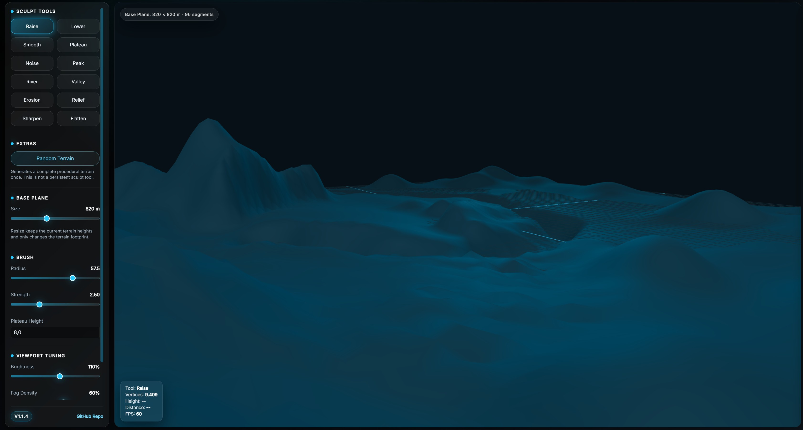
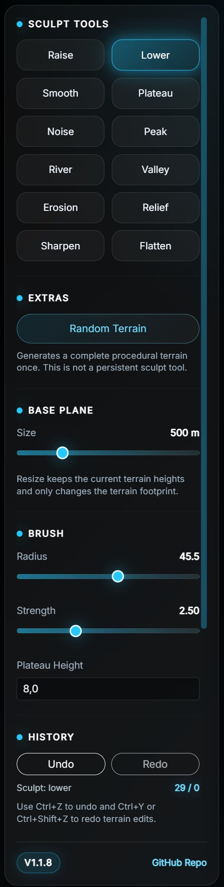

# TERRAit Static Web Terrain Editor

TERRAit is a lightweight static terrain editor for fast manual landscape blocking, sculpting and heightmap export. It is designed for a quick local workflow without Electron, Node.js or an installation step. The application runs from plain project files and stores/export data through browser download and upload APIs.

The V1.1.5 build is prepared for offline use. External CDN references were removed and the required UI compatibility files are included locally in `assets/vendor/`. The renderer uses vanilla WebGL2, so the editor does not need Three.js from a CDN.

---

## Start

Use the included Windows starter:

```bat
start_webserver.bat
```

Then open:

```text
http://127.0.0.1:8080/
```

A local webserver is required because browsers block some file loading features when opening `index.html` directly from disk. The starter uses Python's built-in static webserver if Python is installed. Any other static webserver works as well.

---

## Controls

| Action | Input |
|---|---|
| Sculpt terrain | Left mouse drag |
| Pan / move viewport | Ctrl + left mouse drag |
| Orbit / rotate camera | Alt + left mouse drag |
| Pan, Cinema-style | Alt + middle mouse drag |
| Zoom / dolly, Cinema-style | Alt + right mouse drag |
| Zoom | Mouse wheel |
| Alternative pan | Hold `1` + left mouse drag |
| Alternative zoom | Hold `2` + left mouse drag |
| Alternative orbit | Hold `3` + left mouse drag |

The same control summary can be shown inside the viewport through **View → Control shortcuts**.

---

## Important Notes

- Use a modern Chromium, Edge or Firefox browser with WebGL2 support.
- The app is fully static and does not require Node.js, npm or Electron.
- The included Bootstrap files are a compact local compatibility layer for this project, not a full Bootstrap distribution.
- Editable project data is saved as `.terrait` JSON.
- Plane-like `.obj` files can be imported and converted into editable terrain.
- STL and FBX preview import is intentionally not included in this CDN-free vanilla WebGL build.
- OBJ export, ASCII STL export and 16-bit grayscale PNG heightmap export are available.
- The in-app documentation is loaded from `assets/Docu.md` and can be edited without changing the JavaScript.

---

## Previews





---

## Main Features

### Base Terrain

TERRAit starts with an editable 500 × 500 meter base plane. The terrain footprint can be changed later through the **Base Plane Size** slider or through the geometry input on the right panel. Resizing keeps the current height data and only changes the real-world footprint of the plane.

### Geometry Detail

The **Polygons / Tessellation** slider controls the terrain grid resolution. Higher values create smoother sculpting and exports, but they require more GPU and CPU work. The **More Detail** and **Less Detail** buttons change tessellation in quick steps while preserving existing heights through resampling.

---

### Sculpt Tools

| Tool | Purpose |
|---|---|
| Raise | Lifts terrain inside the brush radius. |
| Lower | Pushes terrain downward. |
| Smooth | Softens sharp transitions and uneven areas. |
| Plateau | Pulls the brush area toward the configured plateau height. |
| Noise | Adds small organic height variation. |
| Peak | Builds stronger mountain-like peaks. |
| River | Cuts a tighter river/channel-like groove. |
| Valley | Creates broader terrain depressions. |
| Erosion | Softens and slightly wears down detailed terrain. |
| Relief | Adds fine surface relief and micro variation. |
| Sharpen | Increases local height contrast and harder edges. |
| Flatten | Levels the brush area toward its local average height. |

---

### Extras

**Random Terrain** is a one-shot generator. It creates a complete procedural landscape with layered noise and does not remain selected as a sculpt tool.

---

### Viewport Tuning

The left panel includes controls for brightness, light temperature and fog density. Light temperature moves the scene from cooler blue lighting toward a more neutral or slightly warmer look. The right panel includes view toggles for wireframe, grid, fog, height meter, distance readout, brush cursor and the shortcut overlay.

---

### Import and Export

- **Save `.terrait`**: Stores the editable terrain, size, tessellation and heights.
- **Load `.terrait`**: Restores a saved editable project.
- **Import OBJ**: Converts plane-like OBJ vertex data into editable terrain heights.
- **Export OBJ**: Exports the current terrain mesh.
- **Export STL**: Exports the current terrain as ASCII STL for further processing or 3D workflows.
- **Export 16-bit Heightmap PNG**: Exports grayscale height data with 16-bit precision.

---

## Documentation

The info button in the top right opens a formatted documentation panel. Its content is loaded from:

```text
assets/Docu.md
```

Edit that file to customize the in-app help text. Keep the app running through a local webserver so the browser can fetch the Markdown file.

---

## Folder Structure

```text
TERRAit_static_web_v5/
├─ index.html
├─ start_webserver.bat
├─ README.md
├─ css/
│  └─ style.css
├─ js/
│  └─ app.js
└─ assets/
   ├─ Docu.md
   ├─ fonts/
   │  ├─ OpenSans-Regular.ttf
   │  └─ OpenSans-Semibold.ttf
   ├─ img/
   │  ├─ favicon.png
   │  └─ logo.png
   ├─ models/
   │  ├─ base_plane.mtl
   │  └─ base_plane.obj
   └─ vendor/
      └─ bootstrap/
         ├─ css/bootstrap.min.css
         └─ js/bootstrap.bundle.min.js
```

---

## Offline Usage

The editor is intended to work without internet access after the ZIP has been extracted. Do not replace the local vendor paths with CDN links if the project should stay offline-capable.

---

## Known Scope

TERRAit is a compact static editor for fast terrain blocking and manual sculpting. It is not a full GIS, simulation or CAD application. Complex asset import/export pipelines are intentionally kept small to preserve the lightweight workflow.

---

### © complicatiion aka sksdesign · 2026 

---

